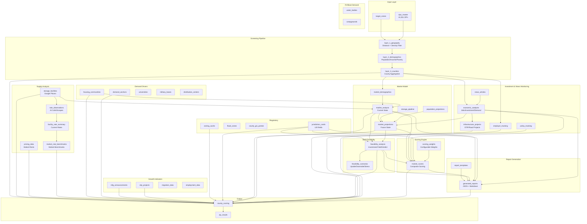
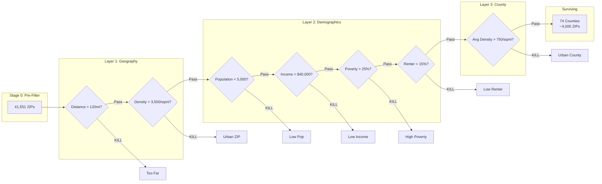
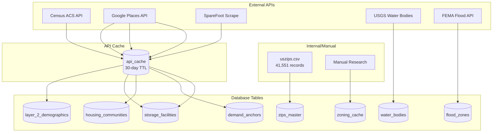

# Storage Site Screener - Entity Relationship Diagram

## Full Database ERD

```mermaid
erDiagram
    %% =====================================================
    %% CORE ZONE & RUN MANAGEMENT
    %% =====================================================

    target_zones {
        int zone_id PK
        varchar zone_name
        varchar center_zip
        numeric center_lat
        numeric center_lon
        int radius_miles
        array states
        timestamp created_at
    }

    runs {
        uuid run_id PK
        timestamp created_at
        varchar created_by
        array target_states
        jsonb config
        varchar status
        int current_stage
        int total_zips
        int surviving_zips
        timestamp completed_at
        text error_message
    }

    stage_log {
        int id PK
        uuid run_id FK
        int stage
        timestamp started_at
        timestamp completed_at
        int zips_input
        int zips_output
        int zips_killed
        varchar status
        text error_message
    }

    zip_results {
        int id PK
        uuid run_id FK
        varchar zip
        int stage_reached
        boolean killed
        int kill_stage
        varchar kill_step
        text kill_reason
        numeric kill_threshold
        numeric kill_value
        jsonb metrics
        jsonb scores
        numeric final_score
        int tier
        int rank
    }

    %% =====================================================
    %% MASTER DATA - ZIP CODES
    %% =====================================================

    zips_master {
        varchar zip PK
        numeric lat
        numeric lng
        varchar city
        varchar state
        varchar county_fips
        varchar county_name
        int population
        numeric density
        int income_household_median
        numeric home_ownership
        int home_value
        numeric age_median
    }

    zone_zips {
        int id PK
        int zone_id FK
        varchar zip
        numeric distance_miles
        boolean included
    }

    %% =====================================================
    %% SCREENING PIPELINE LAYERS
    %% =====================================================

    layer_1_geography {
        varchar zip PK
        int zone_id FK
        varchar state
        varchar county_fips
        varchar county_name
        numeric centroid_lat
        numeric centroid_lon
        numeric distance_miles
        boolean passed
        varchar kill_reason
    }

    layer_2_demographics {
        varchar zip PK
        int population
        int median_income
        numeric poverty_rate
        numeric renter_pct
        numeric median_age
        int housing_units
        int sfh_units
        int townhome_units
        int apartment_units
        int mobile_home_units
        boolean passed
        varchar kill_reason
    }

    layer_3_counties {
        varchar county_fips PK
        varchar state
        varchar county_name
        int surviving_zips
        int total_population
        int total_housing_units
        int total_sfh
        int total_townhome
        int total_apartment
        int total_mobile_home
        int avg_income
        numeric avg_poverty
        numeric avg_renter_pct
        bigint demand_sqft
        int high_demand_units
    }

    county_scoring {
        varchar county_fips PK
        int demand_score
        int supply_score
        int growth_score
        int risk_score
        int access_score
        int total_score
        int tier
        text notes
        timestamp scored_at
    }

    %% =====================================================
    %% SUPPLY DATA - EXISTING FACILITIES
    %% =====================================================

    storage_facilities {
        int id PK
        varchar place_id
        varchar name
        varchar address
        varchar city
        varchar state
        varchar zip
        varchar county_fips
        numeric lat
        numeric lon
        int total_sqft
        int unit_count
        int year_built
        boolean climate_controlled
        boolean drive_up
        boolean rv_boat
        varchar owner_operator
        numeric rating
        int review_count
        int asking_rent_10x10
        int asking_rent_10x20
        boolean no_competition_5mi
        numeric nearest_competitor_miles
    }

    pricing_data {
        int id PK
        varchar zip
        varchar facility_name
        varchar unit_size
        numeric monthly_rent
        varchar source
        date researched_at
    }

    %% =====================================================
    %% DEMAND DRIVERS
    %% =====================================================

    housing_communities {
        int id PK
        varchar name
        varchar address
        varchar city
        varchar state
        varchar zip
        varchar county_fips
        numeric lat
        numeric lon
        varchar community_type
        varchar status
        int total_units
        int year_built
        date permit_date
        date completion_date
        varchar builder
    }

    demand_anchors {
        int id PK
        varchar place_id
        varchar name
        varchar anchor_type
        varchar address
        varchar city
        varchar state
        varchar zip
        varchar county_fips
        numeric lat
        numeric lon
        varchar size_estimate
        int student_count
        int employee_count
        int unit_count
    }

    universities {
        int id PK
        varchar name
        varchar ipeds_id
        varchar institution_type
        varchar state
        varchar county
        varchar city
        int total_enrollment
        int undergrad_enrollment
        int has_dorms
        int dorm_capacity
        numeric lat
        numeric lng
    }

    military_bases {
        int id PK
        varchar name
        varchar branch
        varchar installation_type
        varchar state
        varchar county
        int military_personnel
        int civilian_personnel
        int total_personnel
        numeric lat
        numeric lng
    }

    distribution_centers {
        int id PK
        varchar company
        varchar facility_name
        varchar facility_type
        varchar state
        varchar county
        varchar city
        int sqft
        int employees
        int opened_year
        numeric lat
        numeric lng
    }

    %% =====================================================
    %% GROWTH INDICATORS
    %% =====================================================

    mfg_announcements {
        int id PK
        varchar state
        varchar company_name
        varchar project_name
        varchar city
        varchar county
        date announcement_date
        int jobs_created
        numeric investment_amount
        varchar industry
        boolean is_chips_act
        boolean is_ira
        boolean is_reshoring
    }

    stip_projects {
        int id PK
        varchar state
        varchar project_id
        varchar project_name
        varchar route
        varchar county
        text description
        varchar project_type
        numeric estimated_cost
        int start_year
        int completion_year
    }

    migration_data {
        int id PK
        int data_year
        varchar origin_state
        varchar origin_county_fips
        varchar dest_state
        varchar dest_county_fips
        int returns
        int exemptions
        numeric agi
        varchar flow_direction
    }

    employment_data {
        int id PK
        int data_year
        int data_quarter
        varchar state
        varchar county_fips
        varchar naics_code
        varchar naics_title
        int establishments
        int employment
        numeric total_wages
        numeric avg_weekly_wage
    }

    %% =====================================================
    %% RV/BOAT DEMAND DRIVERS
    %% =====================================================

    water_bodies {
        int id PK
        varchar name
        varchar water_type
        varchar state
        varchar county
        numeric area_acres
        numeric perimeter_miles
        boolean has_public_access
        boolean has_marina
        boolean has_boat_launch
        numeric centroid_lat
        numeric centroid_lng
    }

    campgrounds {
        int id PK
        varchar name
        varchar campground_type
        varchar state
        varchar county
        varchar city
        int total_sites
        int rv_sites
        boolean has_hookups
        numeric lat
        numeric lng
        numeric google_rating
        int google_review_count
    }

    %% =====================================================
    %% REGULATORY & RISK
    %% =====================================================

    zoning_cache {
        varchar county_fips PK
        varchar state
        varchar county_name
        varchar storage_allowed
        boolean moratorium
        text conditional_notes
        varchar source_url
        varchar researched_by
        date researched_at
    }

    county_gis_portals {
        int id PK
        varchar state
        varchar county_fips
        varchar county_name
        varchar gis_portal_url
        varchar zoning_map_url
        varchar parcel_search_url
        varchar planning_dept_url
    }

    flood_zones {
        int id PK
        varchar zone_id
        varchar county_fips
        varchar risk_level
        text geometry_json
    }

    traffic_data {
        int id PK
        varchar zip
        varchar road_name
        int aadt
        int aadt_year
        boolean visibility_ok
        int turn_count
    }

    %% =====================================================
    %% JURISDICTION INTELLIGENCE
    %% =====================================================

    jurisdiction_cards {
        int id PK
        varchar state
        varchar county_fips FK
        varchar county_name
        varchar jurisdiction
        varchar jurisdiction_type
        boolean has_zoning
        varchar storage_allowed
        varchar storage_zones
        int min_aisle_width_ft
        int min_lot_size_acres
        int max_lot_coverage_pct
        int max_building_height_ft
        int setback_front_ft
        int setback_side_ft
        int setback_rear_ft
        int landscape_buffer_front_ft
        boolean fence_required
        varchar fence_type
        boolean masonry_required
        int masonry_pct
        boolean stormwater_required
        varchar stormwater_method
        varchar permit_office_name
        varchar permit_office_phone
        varchar permit_portal_url
        varchar permit_portal_type
        boolean permit_online_available
        boolean permit_data_available
        varchar permit_data_method
        boolean inspection_data_available
        varchar approval_process
        boolean public_hearing_required
        int approval_timeline_days
        int difficulty_score
        varchar difficulty_rating
        varchar confidence
        text research_gaps
        timestamp created_at
        timestamp updated_at
    }

    jurisdiction_research_checklist {
        int id PK
        int jurisdiction_card_id FK
        boolean chk_has_zoning
        boolean chk_storage_allowed
        boolean chk_storage_zones
        boolean chk_aisle_width
        boolean chk_lot_coverage
        boolean chk_height_limit
        boolean chk_setbacks
        boolean chk_landscape
        boolean chk_fence
        boolean chk_masonry
        boolean chk_stormwater
        boolean chk_permit_office
        boolean chk_permit_portal
        boolean chk_permit_fees
        boolean chk_approval_process
        boolean chk_timeline
        boolean chk_gis_url
        timestamp last_updated
    }

    deep_dive_wv_eastern {
        int id PK
        varchar place_id
        varchar name
        varchar address
        varchar city
        varchar county_fips FK
        varchar county_name
        decimal lat
        decimal lon
        varchar phone_number
        decimal rating
        int review_count
        int rate_10x10
        int rate_10x20
        boolean has_climate
        decimal nearest_competitor_miles
        int competitors_within_3mi
        int competitors_within_5mi
    }

    facility_call_results {
        int id PK
        int facility_id FK
        timestamp call_datetime
        int call_duration_seconds
        varchar call_status
        varchar availability_10x10
        int rate_10x10
        int rate_10x20
        boolean has_climate_control
        int climate_premium
        text move_in_special
        text transcript
        varchar caller_service
    }

    %% =====================================================
    %% BUILD IMPACT CALCULATOR
    %% =====================================================

    build_model_defaults {
        int id PK
        varchar model_name
        decimal base_lot_acres
        int base_lot_sqft
        int building_width_ft
        int building_length_ft
        int building_count
        int units_per_building
        int total_units
        int base_aisle_width_ft
        int land_cost_per_acre
        int building_cost_per_building
        int base_total_investment
        int rent_per_unit
        decimal expense_ratio
        decimal target_yield_pct
        boolean is_active
    }

    build_impact_analysis {
        int id PK
        int jurisdiction_card_id FK
        int build_model_id FK
        varchar county_fips
        varchar jurisdiction
        decimal input_lot_acres
        int total_setback_loss_sqft
        int total_buffer_loss_sqft
        int net_buildable_sqft
        int max_lot_coverage_pct
        int rows_with_required_aisle
        decimal height_multiplier
        int base_building_count
        int adjusted_building_count
        int base_unit_count
        int adjusted_unit_count
        decimal capacity_loss_pct
        int total_landscape_cost
        int fence_cost
        int masonry_cost
        int stormwater_cost
        int total_added_costs
        int base_investment
        int adjusted_investment
        int rent_per_unit
        int adjusted_noi_annual
        decimal adjusted_yield_pct
        int breakeven_rent
        int rent_cushion
        varchar capacity_impact
        varchar cost_impact
        varchar overall_verdict
        text verdict_reason
    }

    %% =====================================================
    %% PERMIT FILTERING & HOUSING PIPELINE
    %% =====================================================

    permits_raw {
        int id PK
        varchar state
        varchar county_fips
        varchar county_name
        varchar permit_number
        varchar permit_type
        varchar permit_subtype
        text description
        varchar project_name
        text address
        varchar city
        varchar zip_code
        decimal latitude
        decimal longitude
        date application_date
        date issue_date
        decimal valuation
        int unit_count
        int building_sqft
        varchar permit_status
        boolean is_housing_related
        varchar housing_type
        decimal classification_confidence
        array classification_keywords
        varchar source_name
        timestamp processed_at
        varchar source_hash UK
    }

    housing_pipeline {
        int id PK
        int permit_id FK
        varchar county_fips
        varchar county_name
        varchar state
        text address
        varchar city
        decimal latitude
        decimal longitude
        varchar project_name
        varchar housing_type
        int unit_count
        int building_sqft
        decimal lot_acres
        decimal valuation
        date application_date
        date approved_date
        date construction_start
        date estimated_completion
        date actual_completion
        varchar pipeline_status
        text status_reason
        decimal distance_miles
        varchar demand_impact
        text notes
        timestamp created_at
        timestamp updated_at
        varchar status
        varchar status_color
        date permit_date
        date site_work_date
        date vertical_date
        date completion_date
        int primary_permit_id FK
        array permit_numbers
        text project_address
        varchar parcel_id
    }

    housing_keywords_include {
        int id PK
        varchar keyword UK
        varchar housing_type
        decimal weight
        boolean is_phrase
        text notes
    }

    housing_keywords_exclude {
        int id PK
        varchar keyword UK
        varchar reason
        decimal weight
        text notes
    }

    %% =====================================================
    %% INSPECTION TRACKING
    %% =====================================================

    inspections_raw {
        int id PK
        varchar state
        varchar county_fips
        varchar county_name
        varchar jurisdiction
        varchar permit_number
        int permit_id FK
        varchar inspection_number UK
        varchar inspection_type
        varchar inspection_category
        text inspection_description
        varchar address
        varchar parcel_id
        date requested_date
        date scheduled_date
        date inspection_date
        varchar inspector_name
        varchar result
        varchar result_code
        text result_comments
        boolean reinspection_required
        varchar inspection_status
        boolean is_processed
        boolean is_status_trigger
        varchar triggered_status
        int pipeline_id FK
        timestamp fetched_at
    }

    inspection_type_mapping {
        int id PK
        varchar keyword
        varchar category
        varchar phase
        varchar triggers_status
        int phase_order
        boolean is_active
    }

    pipeline_status_log {
        int id PK
        int pipeline_id FK
        varchar old_status
        varchar new_status
        timestamp changed_at
        int trigger_inspection_id FK
        varchar trigger_source
        text notes
    }

    %% =====================================================
    %% MARKET MODEL (SUPPLY, DEMAND, SATURATION)
    %% =====================================================

    market_demographics {
        int id PK
        varchar geo_type
        varchar geo_id UK
        varchar geo_name
        varchar state
        int population
        int households
        decimal population_density
        decimal median_age
        int total_housing_units
        int sfh_units
        int townhome_units
        int apartment_units
        int condo_units
        decimal renter_pct
        int median_income
        int total_movers
        decimal mover_pct
        int data_year
        varchar data_source
    }

    market_analysis {
        int id PK
        varchar geo_type
        varchar geo_id
        varchar geo_name
        varchar state
        date analysis_date
        int facility_count
        bigint total_supply_sqft
        bigint climate_supply_sqft
        int reit_facilities
        int independent_facilities
        varchar top_operator
        int population
        int households
        int high_demand_units
        int low_demand_units
        bigint base_demand_sqft
        bigint adjusted_demand_sqft
        decimal sqft_per_capita
        decimal sqft_per_household
        varchar saturation_level
        int saturation_score
        decimal avg_rent_10x10
        int market_health_score
        varchar market_health_rating
        text primary_opportunity
        text primary_risk
    }

    %% =====================================================
    %% FUTURE STATE MARKET MODEL (PROJECTIONS)
    %% =====================================================

    storage_pipeline {
        int id PK
        varchar county_fips FK
        varchar county_name
        varchar state
        varchar project_name
        varchar project_type
        varchar developer
        int planned_sqft
        int planned_units
        boolean climate_controlled
        date announced_date
        date permit_date
        date construction_start
        date estimated_completion
        varchar pipeline_status
        varchar data_source
        decimal confidence_score
        text notes
        timestamp created_at
        timestamp updated_at
    }

    population_projections {
        int id PK
        varchar geo_type
        varchar geo_id FK
        varchar geo_name
        varchar state
        int base_year
        int base_population
        int base_households
        int proj_year_1
        int pop_year_1
        int hh_year_1
        int proj_year_2
        int pop_year_2
        int hh_year_2
        int proj_year_3
        int pop_year_3
        int hh_year_3
        decimal annual_growth_rate
        varchar projection_source
        varchar projection_scenario
        text methodology_notes
        timestamp created_at
    }

    market_projections {
        int id PK
        varchar geo_type
        varchar geo_id FK
        varchar geo_name
        varchar state
        date projection_date
        varchar current_saturation
        decimal current_sqft_per_cap
        int current_supply_sqft
        int current_demand_sqft
        int pipeline_sqft
        int housing_pipeline_units
        int proj_y1_supply
        int proj_y1_demand
        decimal proj_y1_sqft_cap
        varchar proj_y1_saturation
        int proj_y2_supply
        int proj_y2_demand
        decimal proj_y2_sqft_cap
        varchar proj_y2_saturation
        int proj_y3_supply
        int proj_y3_demand
        decimal proj_y3_sqft_cap
        varchar proj_y3_saturation
        varchar trajectory
        int opportunity_score
        varchar recommendation
        varchar risk_level
        text rationale
        timestamp created_at
    }

    %% =====================================================
    %% BUILD FEASIBILITY MODEL
    %% =====================================================

    feasibility_analysis {
        int id PK
        int jurisdiction_card_id FK
        int build_impact_id FK
        int market_analysis_id FK
        int market_projection_id FK
        varchar state
        varchar county_fips
        varchar county_name
        varchar jurisdiction
        date analysis_date
        decimal lot_acres
        int lot_cost_per_acre
        int lot_cost_total
        int building_count
        int unit_count
        int rentable_sqft
        decimal capacity_loss_pct
        int site_work_cost
        int building_cost
        int regulation_added_costs
        int soft_costs
        int contingency
        int total_construction_cost
        int total_investment
        int cost_per_unit
        int cost_per_sqft
        decimal market_rent_10x10
        decimal market_rent_per_sqft
        varchar rent_source
        varchar rent_confidence
        decimal y1_occupancy_pct
        decimal y2_occupancy_pct
        decimal y3_occupancy_pct
        int y1_noi
        int y2_noi
        int y3_noi
        int stabilized_noi
        decimal y1_yield_pct
        decimal y2_yield_pct
        decimal y3_yield_pct
        decimal stabilized_yield_pct
        decimal target_yield_pct
        int breakeven_rent_per_unit
        decimal breakeven_rent_per_sqft
        int rent_cushion_per_unit
        decimal rent_cushion_pct
        varchar cushion_rating
        int financial_score
        int market_score
        int regulation_score
        int composite_score
        varchar financial_verdict
        varchar overall_verdict
        text verdict_summary
        text primary_strength
        text primary_weakness
        varchar recommended_action
        text conditions
        timestamp created_at
    }

    feasibility_scenarios {
        int id PK
        int feasibility_id FK
        varchar scenario_name
        varchar scenario_type
        decimal lot_acres
        int lot_cost_per_acre
        int unit_count
        decimal market_rent
        decimal occupancy_pct
        decimal expense_ratio
        decimal rent_growth_pct
        int total_investment
        int stabilized_noi
        decimal stabilized_yield_pct
        int breakeven_rent
        decimal rent_cushion_pct
        boolean meets_target
        varchar scenario_verdict
        text notes
        timestamp created_at
    }

    %% =====================================================
    %% INVESTMENT & NEWS MONITORING
    %% =====================================================

    economic_catalysts {
        int id PK
        varchar catalyst_name
        varchar catalyst_type
        varchar catalyst_subtype
        varchar state
        varchar county_fips FK
        varchar county_name
        varchar city
        varchar company_name
        varchar company_industry
        varchar company_type
        date announcement_date
        varchar status
        date status_date
        bigint investment_amount
        int jobs_announced
        int jobs_phase_1
        int avg_salary
        int facility_sqft
        varchar facility_type
        varchar demand_impact
        int demand_score
        int housing_demand_units
        int storage_demand_sqft
        varchar demand_timing
        varchar confidence
        boolean is_active
        varchar source
        timestamp created_at
        timestamp updated_at
    }

    news_articles {
        int id PK
        varchar headline
        text summary
        varchar source_name
        varchar source_url UK
        date published_date
        varchar category
        varchar subcategory
        int relevance_score
        varchar state
        varchar county_fips FK
        varchar county_name
        int catalyst_id FK
        boolean is_catalyst_source
        boolean is_processed
        boolean is_relevant
        varchar action_required
        timestamp created_at
    }

    policy_tracking {
        int id PK
        varchar policy_name
        varchar policy_type
        varchar policy_category
        varchar jurisdiction_level
        varchar state
        varchar county_fips FK
        varchar county_name
        varchar status
        date effective_date
        text description
        text key_provisions
        varchar impact_type
        int impact_score
        varchar storage_impact
        text storage_impact_description
        boolean is_active
        timestamp created_at
        timestamp updated_at
    }

    employer_tracking {
        int id PK
        varchar company_name
        varchar parent_company
        varchar industry
        varchar naics_code
        varchar company_size
        varchar state
        varchar county_fips FK
        varchar county_name
        int current_employees
        varchar employee_trend
        decimal growth_rate_pct
        varchar facility_type
        int facility_sqft
        boolean is_major_employer
        int employer_rank
        date last_announcement_date
        varchar last_announcement_type
        int last_announcement_jobs
        int stability_score
        varchar expansion_likelihood
        varchar contraction_risk
        int estimated_storage_demand_sqft
        boolean is_active
        timestamp created_at
        timestamp updated_at
    }

    infrastructure_projects {
        int id PK
        int catalyst_id FK
        varchar stip_id
        varchar federal_project_id
        varchar project_name
        varchar project_type
        varchar project_subtype
        varchar route_name
        varchar route_type
        decimal length_miles
        int existing_lanes
        int proposed_lanes
        int lanes_added
        boolean is_new_interchange
        varchar interchange_type
        boolean is_new_alignment
        boolean is_widening
        boolean is_bridge
        bigint total_cost
        bigint federal_funding
        bigint state_funding
        varchar current_phase
        date construction_start_date
        date construction_end_date
        int stip_year
        boolean enables_development
        int development_acres_opened
        varchar storage_site_relevance
        text storage_relevance_notes
        varchar mpo
        varchar data_source
        timestamp created_at
        timestamp updated_at
    }

    %% =====================================================
    %% SCORING ENGINE
    %% =====================================================

    scoring_weights {
        int id PK
        varchar weight_set_name UK
        text description
        decimal financial_weight
        decimal market_weight
        decimal trajectory_weight
        decimal catalyst_weight
        decimal regulation_weight
        decimal yield_weight
        decimal cushion_weight
        decimal breakeven_weight
        decimal saturation_weight
        decimal rent_weight
        decimal demand_weight
        decimal population_growth_weight
        decimal income_growth_weight
        decimal housing_growth_weight
        int tier_a_threshold
        int tier_b_threshold
        int tier_c_threshold
        int tier_d_threshold
        decimal min_yield_threshold
        decimal max_saturation_threshold
        decimal min_cushion_threshold
        boolean is_active
        timestamp created_at
        timestamp updated_at
    }

    market_scores {
        int id PK
        varchar county_fips FK
        int weight_set_id FK
        decimal raw_projected_yield
        decimal raw_rent_cushion
        decimal raw_breakeven_rent
        decimal raw_market_rent
        decimal raw_saturation_ratio
        decimal raw_demand_score
        decimal raw_population_growth
        decimal raw_income_growth
        decimal raw_housing_growth
        decimal raw_catalyst_impact
        decimal raw_regulation_score
        decimal financial_score
        decimal market_score
        decimal trajectory_score
        decimal catalyst_score
        decimal regulation_score
        decimal yield_score
        decimal cushion_score
        decimal breakeven_score
        decimal saturation_score
        decimal rent_score
        decimal demand_score
        decimal population_growth_score
        decimal income_growth_score
        decimal housing_growth_score
        decimal composite_score
        int market_rank
        varchar tier
        varchar recommendation
        boolean has_fatal_flaw
        array fatal_flaw_reasons
        timestamp scored_at
        int data_freshness_days
    }

    %% =====================================================
    %% REPORT GENERATION
    %% =====================================================

    report_templates {
        int id PK
        varchar template_name UK
        varchar template_type
        boolean include_executive_summary
        boolean include_market_overview
        boolean include_supply_analysis
        boolean include_demand_analysis
        boolean include_pipeline_analysis
        boolean include_catalyst_analysis
        boolean include_regulatory_analysis
        boolean include_financial_analysis
        boolean include_risk_assessment
        boolean include_recommendation
        boolean include_appendix
        boolean include_charts
        boolean include_tables
        boolean include_maps
        text description
        boolean is_active
        timestamp created_at
    }

    generated_reports {
        int id PK
        uuid report_uuid UK
        varchar report_name
        varchar report_type
        int template_id FK
        varchar geo_type
        array geo_ids
        array county_fips_list
        jsonb report_json
        text report_markdown
        timestamp generated_at
        varchar generated_by
        boolean is_draft
        boolean is_archived
        text notes
    }

    %% =====================================================
    %% RENTAL RATE INTELLIGENCE
    %% =====================================================

    rate_observations {
        int id PK
        int facility_id FK
        varchar collection_method
        date collection_date
        varchar collected_by
        varchar call_id
        int call_duration_seconds
        varchar call_recording_url
        varchar unit_size
        int unit_sqft
        boolean is_climate_control
        boolean is_drive_up
        boolean is_interior
        varchar floor_level
        decimal advertised_rate
        decimal web_rate
        decimal walk_in_rate
        boolean has_promo
        text promo_description
        int promo_months
        decimal promo_discount_pct
        decimal effective_rate_with_promo
        decimal admin_fee
        boolean insurance_required
        decimal insurance_monthly
        boolean is_available
        int units_available
        boolean waitlist
        decimal rate_per_sqft
        decimal effective_rate_per_sqft
        varchar confidence
        boolean needs_verification
        text verification_notes
        jsonb raw_response
        timestamp created_at
    }

    facility_rate_summary {
        int id PK
        int facility_id FK
        date last_rate_date
        varchar last_rate_method
        int rate_age_days
        decimal rate_5x5
        decimal rate_5x10
        decimal rate_10x10
        decimal rate_10x15
        decimal rate_10x20
        decimal rate_10x30
        decimal rate_5x5_climate
        decimal rate_5x10_climate
        decimal rate_10x10_climate
        decimal rate_10x15_climate
        decimal rate_10x20_climate
        decimal avg_rate_per_sqft
        decimal avg_rate_per_sqft_climate
        decimal min_rate_per_sqft
        decimal max_rate_per_sqft
        boolean has_active_promos
        varchar typical_promo_type
        varchar promo_aggressiveness
        decimal admin_fee
        boolean requires_insurance
        varchar availability_status
        varchar pricing_tier
        varchar rate_confidence
        int data_completeness_pct
        timestamp updated_at
    }

    market_rate_benchmarks {
        int id PK
        varchar geo_type
        varchar geo_id
        varchar geo_name
        varchar state
        date benchmark_date
        int facility_count
        int facilities_with_rates
        int rate_observation_count
        decimal avg_10x10
        decimal median_10x10
        decimal min_10x10
        decimal max_10x10
        decimal stddev_10x10
        decimal avg_10x10_climate
        decimal median_10x10_climate
        decimal climate_premium_pct
        decimal avg_rate_per_sqft
        decimal median_rate_per_sqft
        decimal rate_spread_pct
        decimal pct_facilities_with_promos
        decimal avg_promo_discount_pct
        decimal yoy_rate_change_pct
        varchar benchmark_confidence
        timestamp created_at
    }

    %% =====================================================
    %% SYSTEM TABLES
    %% =====================================================

    api_cache {
        varchar cache_key PK
        varchar endpoint
        jsonb request_params
        jsonb response
        timestamp fetched_at
        timestamp expires_at
    }

    data_dictionary {
        varchar column_id PK
        varchar table_name
        varchar column_name
        varchar data_type
        varchar display_name
        text description
        text example_value
        varchar source
        text business_logic
    }

    table_dictionary {
        varchar table_id PK
        varchar table_name
        varchar display_name
        text description
        text purpose
        varchar layer
        varchar data_source
        varchar refresh_frequency
    }

    %% =====================================================
    %% RELATIONSHIPS
    %% =====================================================

    runs ||--o{ stage_log : "tracks stages"
    runs ||--o{ zip_results : "contains results"

    target_zones ||--o{ zone_zips : "contains"
    target_zones ||--o{ layer_1_geography : "filters"

    zips_master ||--o| layer_1_geography : "screened in"
    zips_master ||--o| layer_2_demographics : "demographics"

    layer_3_counties ||--o{ storage_facilities : "has"
    layer_3_counties ||--o{ housing_communities : "has"
    layer_3_counties ||--o{ demand_anchors : "has"
    layer_3_counties ||--o| county_scoring : "scored"
    layer_3_counties ||--o| zoning_cache : "zoning"

    layer_3_counties ||--o{ jurisdiction_cards : "regulations"
    jurisdiction_cards ||--o| jurisdiction_research_checklist : "checklist"
    jurisdiction_cards ||--o{ build_impact_analysis : "impact analysis"
    build_model_defaults ||--o{ build_impact_analysis : "model"
    layer_3_counties ||--o{ deep_dive_wv_eastern : "facilities"
    deep_dive_wv_eastern ||--o{ facility_call_results : "call results"
    layer_3_counties ||--o{ permits_raw : "permits"
    permits_raw ||--o| housing_pipeline : "tracked"
    housing_keywords_include }o--|| permits_raw : "classifies"
    housing_keywords_exclude }o--|| permits_raw : "excludes"
    permits_raw ||--o{ inspections_raw : "inspections"
    housing_pipeline ||--o{ inspections_raw : "linked"
    housing_pipeline ||--o{ pipeline_status_log : "status history"
    inspections_raw ||--o| pipeline_status_log : "triggers"
    inspection_type_mapping }o--|| inspections_raw : "classifies"
    layer_3_counties ||--o| market_demographics : "demographics"
    layer_3_counties ||--o| market_analysis : "market analysis"
    market_demographics ||--o{ market_analysis : "analyzed"
    storage_facilities }o--|| market_analysis : "supply"
    layer_3_counties ||--o{ storage_pipeline : "planned facilities"
    layer_3_counties ||--o| population_projections : "pop projections"
    layer_3_counties ||--o| market_projections : "market projections"
    market_analysis ||--o| market_projections : "current state"
    storage_pipeline }o--|| market_projections : "supply pipeline"
    population_projections ||--o| market_projections : "demand growth"
    housing_pipeline }o--|| market_projections : "demand pipeline"
    jurisdiction_cards ||--o{ feasibility_analysis : "feasibility"
    build_impact_analysis ||--o| feasibility_analysis : "capacity/costs"
    market_analysis ||--o| feasibility_analysis : "market rents"
    market_projections ||--o| feasibility_analysis : "market trajectory"
    feasibility_analysis ||--o{ feasibility_scenarios : "scenarios"
    layer_3_counties ||--o{ economic_catalysts : "catalysts"
    layer_3_counties ||--o{ news_articles : "news"
    layer_3_counties ||--o{ policy_tracking : "policies"
    layer_3_counties ||--o{ employer_tracking : "employers"
    economic_catalysts ||--o{ news_articles : "source articles"
    economic_catalysts }o--|| market_projections : "demand impact"
    economic_catalysts ||--o| infrastructure_projects : "STIP details"
    layer_3_counties ||--o{ market_scores : "scored"
    scoring_weights ||--o{ market_scores : "weight set"
    feasibility_analysis }o--|| market_scores : "financial inputs"
    market_analysis }o--|| market_scores : "market inputs"
    market_projections }o--|| market_scores : "trajectory inputs"
    economic_catalysts }o--|| market_scores : "catalyst inputs"
    jurisdiction_cards }o--|| market_scores : "regulation inputs"
    report_templates ||--o{ generated_reports : "template"
    layer_3_counties }o--o{ generated_reports : "report scope"
    market_scores }o--|| generated_reports : "scores included"
    feasibility_analysis }o--|| generated_reports : "feasibility included"
    storage_facilities ||--o{ rate_observations : "rate history"
    storage_facilities ||--o| facility_rate_summary : "current rates"
    rate_observations }o--|| facility_rate_summary : "aggregated"
    layer_3_counties ||--o{ market_rate_benchmarks : "benchmarks"
    facility_rate_summary }o--|| market_rate_benchmarks : "benchmark input"
```

## Simplified Pipeline View



## Kill Switch Flow



## Data Source Map



## Table Counts

| Table | Records | Source |
|-------|---------|--------|
| zips_master | 41,551 | uszips.csv |
| layer_1_geography | ~4,000 | Filtered ZIPs |
| layer_2_demographics | ~4,000 | Census ACS |
| layer_3_counties | 74 | Aggregated |
| storage_facilities | 2,344 | Google Places |
| housing_communities | 6,698 | Google Places |
| demand_anchors | 2,666 | Google Places |
| jurisdiction_cards | 3 | Manual Research |
| jurisdiction_research_checklist | 3 | Auto-generated |
| build_model_defaults | 1 | Configuration |
| build_impact_analysis | 3 | Calculated |
| deep_dive_wv_eastern | 155 | Google Places |
| facility_call_results | 0 | AI Caller |
| permits_raw | 11 | Permit Portals |
| housing_pipeline | 5 | Classified |
| housing_keywords_include | 38 | Configuration |
| housing_keywords_exclude | 38 | Configuration |
| inspections_raw | 13 | Inspection Portals |
| inspection_type_mapping | 41 | Configuration |
| pipeline_status_log | 8 | Status Changes |
| market_demographics | 3 | Census ACS |
| market_analysis | 3 | Calculated |
| storage_pipeline | 0 | Permit/News Research |
| population_projections | 3 | Census/State Projections |
| market_projections | 3 | Calculated |
| feasibility_analysis | 3 | Calculated |
| feasibility_scenarios | 9 | Calculated (3 per analysis) |
| economic_catalysts | 11 | News/Research |
| news_articles | 0 | News Feeds |
| policy_tracking | 2 | Research |
| employer_tracking | 0 | Research |
| infrastructure_projects | 6 | STIP/DOT Data |
| scoring_weights | 3 | Configuration |
| market_scores | 3 | Calculated |
| report_templates | 4 | Configuration |
| generated_reports | 2+ | Generated Reports |
| rate_observations | 167 | AI Calls/Scrapes/Manual |
| facility_rate_summary | 16 | Aggregated from observations |
| market_rate_benchmarks | 3 | Geographic benchmarks |
| api_cache | varies | API responses |
