# Storage Site Screener - Entity Relationship Diagram

## Full Database ERD

```mermaid
erDiagram
    %% =====================================================
    %% CORE ZONE & RUN MANAGEMENT
    %% =====================================================

    target_zones {
        int zone_id PK
        varchar zone_name
        varchar center_zip
        numeric center_lat
        numeric center_lon
        int radius_miles
        array states
        timestamp created_at
    }

    runs {
        uuid run_id PK
        timestamp created_at
        varchar created_by
        array target_states
        jsonb config
        varchar status
        int current_stage
        int total_zips
        int surviving_zips
        timestamp completed_at
        text error_message
    }

    stage_log {
        int id PK
        uuid run_id FK
        int stage
        timestamp started_at
        timestamp completed_at
        int zips_input
        int zips_output
        int zips_killed
        varchar status
        text error_message
    }

    zip_results {
        int id PK
        uuid run_id FK
        varchar zip
        int stage_reached
        boolean killed
        int kill_stage
        varchar kill_step
        text kill_reason
        numeric kill_threshold
        numeric kill_value
        jsonb metrics
        jsonb scores
        numeric final_score
        int tier
        int rank
    }

    %% =====================================================
    %% MASTER DATA - ZIP CODES
    %% =====================================================

    zips_master {
        varchar zip PK
        numeric lat
        numeric lng
        varchar city
        varchar state
        varchar county_fips
        varchar county_name
        int population
        numeric density
        int income_household_median
        numeric home_ownership
        int home_value
        numeric age_median
    }

    zone_zips {
        int id PK
        int zone_id FK
        varchar zip
        numeric distance_miles
        boolean included
    }

    %% =====================================================
    %% SCREENING PIPELINE LAYERS
    %% =====================================================

    layer_1_geography {
        varchar zip PK
        int zone_id FK
        varchar state
        varchar county_fips
        varchar county_name
        numeric centroid_lat
        numeric centroid_lon
        numeric distance_miles
        boolean passed
        varchar kill_reason
    }

    layer_2_demographics {
        varchar zip PK
        int population
        int median_income
        numeric poverty_rate
        numeric renter_pct
        numeric median_age
        int housing_units
        int sfh_units
        int townhome_units
        int apartment_units
        int mobile_home_units
        boolean passed
        varchar kill_reason
    }

    layer_3_counties {
        varchar county_fips PK
        varchar state
        varchar county_name
        int surviving_zips
        int total_population
        int total_housing_units
        int total_sfh
        int total_townhome
        int total_apartment
        int total_mobile_home
        int avg_income
        numeric avg_poverty
        numeric avg_renter_pct
        bigint demand_sqft
        int high_demand_units
    }

    county_scoring {
        varchar county_fips PK
        int demand_score
        int supply_score
        int growth_score
        int risk_score
        int access_score
        int total_score
        int tier
        text notes
        timestamp scored_at
    }

    %% =====================================================
    %% SUPPLY DATA - EXISTING FACILITIES
    %% =====================================================

    storage_facilities {
        int id PK
        varchar place_id
        varchar name
        varchar address
        varchar city
        varchar state
        varchar zip
        varchar county_fips
        numeric lat
        numeric lon
        int total_sqft
        int unit_count
        int year_built
        boolean climate_controlled
        boolean drive_up
        boolean rv_boat
        varchar owner_operator
        numeric rating
        int review_count
        int asking_rent_10x10
        int asking_rent_10x20
        boolean no_competition_5mi
        numeric nearest_competitor_miles
    }

    pricing_data {
        int id PK
        varchar zip
        varchar facility_name
        varchar unit_size
        numeric monthly_rent
        varchar source
        date researched_at
    }

    %% =====================================================
    %% DEMAND DRIVERS
    %% =====================================================

    housing_communities {
        int id PK
        varchar name
        varchar address
        varchar city
        varchar state
        varchar zip
        varchar county_fips
        numeric lat
        numeric lon
        varchar community_type
        varchar status
        int total_units
        int year_built
        date permit_date
        date completion_date
        varchar builder
    }

    demand_anchors {
        int id PK
        varchar place_id
        varchar name
        varchar anchor_type
        varchar address
        varchar city
        varchar state
        varchar zip
        varchar county_fips
        numeric lat
        numeric lon
        varchar size_estimate
        int student_count
        int employee_count
        int unit_count
    }

    universities {
        int id PK
        varchar name
        varchar ipeds_id
        varchar institution_type
        varchar state
        varchar county
        varchar city
        int total_enrollment
        int undergrad_enrollment
        int has_dorms
        int dorm_capacity
        numeric lat
        numeric lng
    }

    military_bases {
        int id PK
        varchar name
        varchar branch
        varchar installation_type
        varchar state
        varchar county
        int military_personnel
        int civilian_personnel
        int total_personnel
        numeric lat
        numeric lng
    }

    distribution_centers {
        int id PK
        varchar company
        varchar facility_name
        varchar facility_type
        varchar state
        varchar county
        varchar city
        int sqft
        int employees
        int opened_year
        numeric lat
        numeric lng
    }

    %% =====================================================
    %% GROWTH INDICATORS
    %% =====================================================

    mfg_announcements {
        int id PK
        varchar state
        varchar company_name
        varchar project_name
        varchar city
        varchar county
        date announcement_date
        int jobs_created
        numeric investment_amount
        varchar industry
        boolean is_chips_act
        boolean is_ira
        boolean is_reshoring
    }

    stip_projects {
        int id PK
        varchar state
        varchar project_id
        varchar project_name
        varchar route
        varchar county
        text description
        varchar project_type
        numeric estimated_cost
        int start_year
        int completion_year
    }

    migration_data {
        int id PK
        int data_year
        varchar origin_state
        varchar origin_county_fips
        varchar dest_state
        varchar dest_county_fips
        int returns
        int exemptions
        numeric agi
        varchar flow_direction
    }

    employment_data {
        int id PK
        int data_year
        int data_quarter
        varchar state
        varchar county_fips
        varchar naics_code
        varchar naics_title
        int establishments
        int employment
        numeric total_wages
        numeric avg_weekly_wage
    }

    %% =====================================================
    %% RV/BOAT DEMAND DRIVERS
    %% =====================================================

    water_bodies {
        int id PK
        varchar name
        varchar water_type
        varchar state
        varchar county
        numeric area_acres
        numeric perimeter_miles
        boolean has_public_access
        boolean has_marina
        boolean has_boat_launch
        numeric centroid_lat
        numeric centroid_lng
    }

    campgrounds {
        int id PK
        varchar name
        varchar campground_type
        varchar state
        varchar county
        varchar city
        int total_sites
        int rv_sites
        boolean has_hookups
        numeric lat
        numeric lng
        numeric google_rating
        int google_review_count
    }

    %% =====================================================
    %% REGULATORY & RISK
    %% =====================================================

    zoning_cache {
        varchar county_fips PK
        varchar state
        varchar county_name
        varchar storage_allowed
        boolean moratorium
        text conditional_notes
        varchar source_url
        varchar researched_by
        date researched_at
    }

    county_gis_portals {
        int id PK
        varchar state
        varchar county_fips
        varchar county_name
        varchar gis_portal_url
        varchar zoning_map_url
        varchar parcel_search_url
        varchar planning_dept_url
    }

    flood_zones {
        int id PK
        varchar zone_id
        varchar county_fips
        varchar risk_level
        text geometry_json
    }

    traffic_data {
        int id PK
        varchar zip
        varchar road_name
        int aadt
        int aadt_year
        boolean visibility_ok
        int turn_count
    }

    %% =====================================================
    %% SYSTEM TABLES
    %% =====================================================

    api_cache {
        varchar cache_key PK
        varchar endpoint
        jsonb request_params
        jsonb response
        timestamp fetched_at
        timestamp expires_at
    }

    data_dictionary {
        varchar column_id PK
        varchar table_name
        varchar column_name
        varchar data_type
        varchar display_name
        text description
        text example_value
        varchar source
        text business_logic
    }

    table_dictionary {
        varchar table_id PK
        varchar table_name
        varchar display_name
        text description
        text purpose
        varchar layer
        varchar data_source
        varchar refresh_frequency
    }

    %% =====================================================
    %% RELATIONSHIPS
    %% =====================================================

    runs ||--o{ stage_log : "tracks stages"
    runs ||--o{ zip_results : "contains results"

    target_zones ||--o{ zone_zips : "contains"
    target_zones ||--o{ layer_1_geography : "filters"

    zips_master ||--o| layer_1_geography : "screened in"
    zips_master ||--o| layer_2_demographics : "demographics"

    layer_3_counties ||--o{ storage_facilities : "has"
    layer_3_counties ||--o{ housing_communities : "has"
    layer_3_counties ||--o{ demand_anchors : "has"
    layer_3_counties ||--o| county_scoring : "scored"
    layer_3_counties ||--o| zoning_cache : "zoning"
```

## Simplified Pipeline View

## Kill Switch Flow

## Data Source Map

## Table Counts

| Table | Records | Source |
|-------|---------|--------|
| zips_master | 41,551 | uszips.csv |
| layer_1_geography | ~4,000 | Filtered ZIPs |
| layer_2_demographics | ~4,000 | Census ACS |
| layer_3_counties | 74 | Aggregated |
| storage_facilities | 2,344 | Google Places |
| housing_communities | 6,698 | Google Places |
| demand_anchors | 2,666 | Google Places |
| api_cache | varies | API responses |
